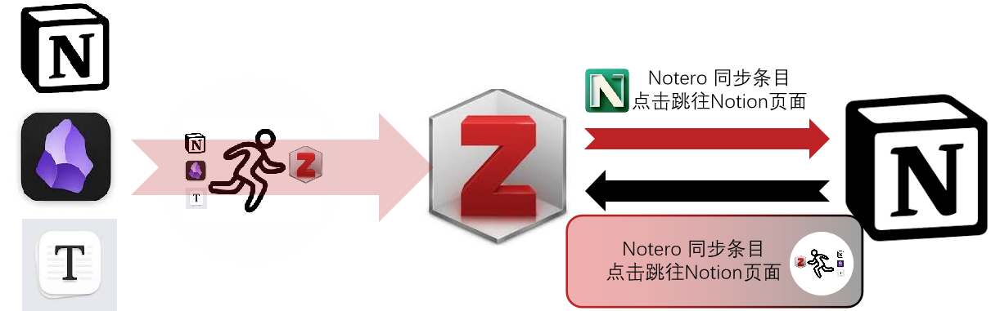

## 介绍

已经有[Notero](https://github.com/dvanoni/notero)实现了从Zotero向Notion的文献条目数据同步与笔记同步，但是不幸的是，该repo无法实现从Zotero向其他兼容Markdown语法的软件的笔记同步，以及无法实现笔记的反向链接功能（也就是从笔记跳转到Zotero的文献条目甚至是pdf里面的标注）。

本Repo目的是实现从Zotero向其他兼容Markdown语法的软件的笔记复制后，具备从笔记跳转回Zotero的特定位置的能力，也就是实现笔记的反向链接功能。




## 安装已编译版本

下载对应版本的[压缩包](https://github.com/Link2Zotero/Link2Zotero/releases)，解压后双击运行 `Link2Zotero.exe` 即可。

## 手动编译方法
```bash
cd path/to/Link2Zotero
pyinstaller --onefile --icon=Link2Zotero_2.ico --noconsole .\CopyReplace\main.py
```

## 使用说明

运行Link2Zotero.exe后，程序可自动监听剪切板，当检测到已复制Zotero笔记后，会自动更新文本使其具备全局跳转功能，（右下角会提示可跳转链个数）直接粘贴至笔记即可。
笔记支持 Notion Typora Obsidian等兼容Markdown语法的软件。 


## 参考
[notero](https://github.com/dvanoni/notero)
[zotero-link](https://github.com/flaribbit/zotero-link)